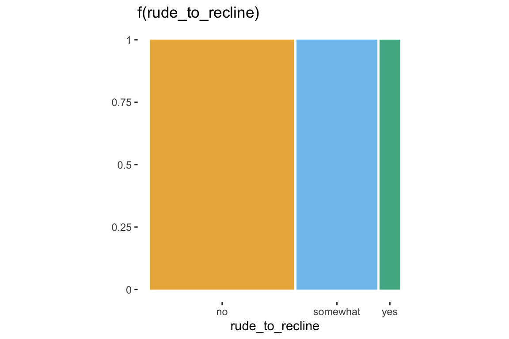
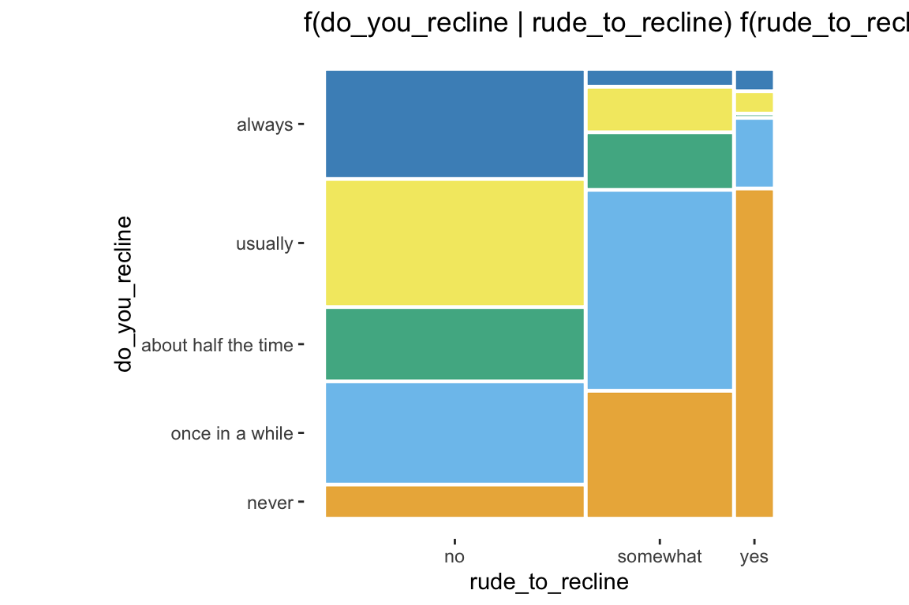
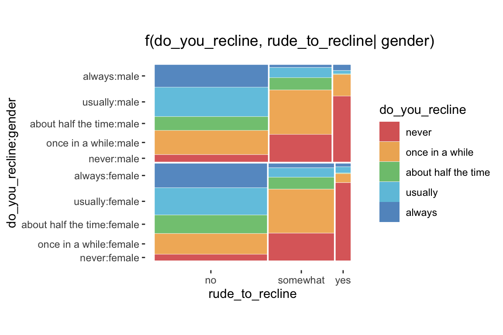
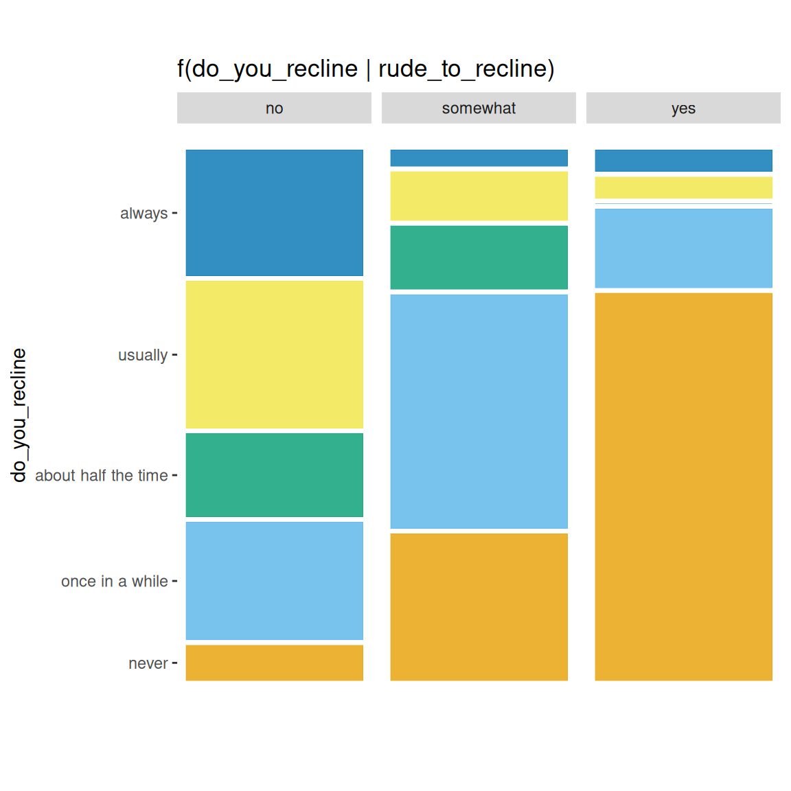
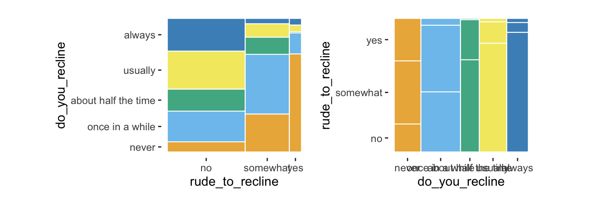
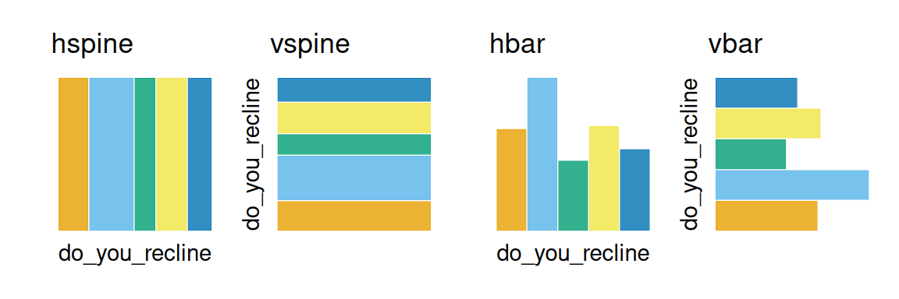
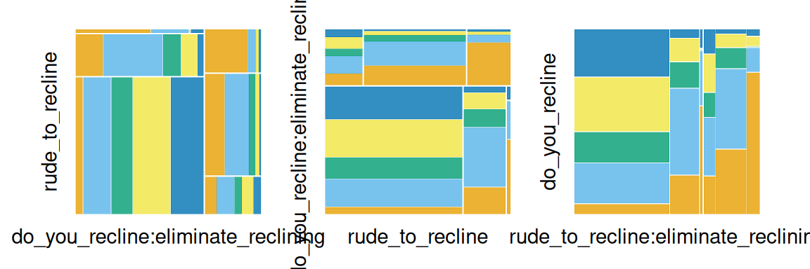
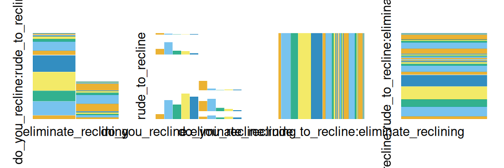
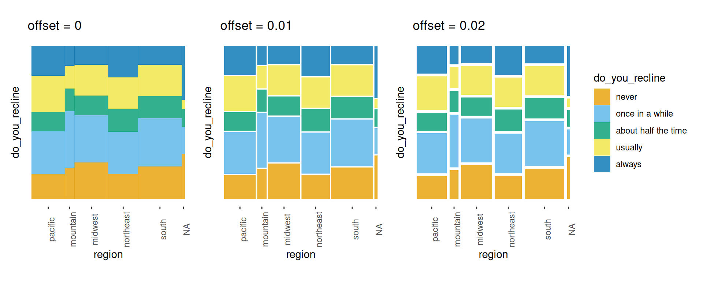

# Mosaic plots with \`ggplot2\`

Designed to create visualizations of categorical data,
[`geom_mosaic()`](https://haleyjeppson.github.io/ggmosaic/reference/geom_mosaic.md)
has the capability to produce bar charts, stacked bar charts, mosaic
plots, and double decker plots and therefore offers a wide range of
potential plots. The plots below highlight the package’s versatility.

``` r
# A few modifications to data
flights <- fly  %>%
  filter(!is.na(do_you_recline), !is.na(rude_to_recline))

bar_examp <- ggplot(data = flights) + 
  geom_mosaic(aes(x=product(do_you_recline), fill = do_you_recline), divider="vbar") +
  theme(axis.text.x = element_blank(),
        axis.ticks.x = element_blank()) +
  labs(y="Do you recline?", x = "", title = "Bar Chart")

spine_examp <- ggplot(data = flights) + 
  geom_mosaic(aes(x=product(do_you_recline), fill = do_you_recline), divider = "vspine") +  
  theme(axis.text.x = element_blank(),
        axis.ticks.x = element_blank()) +
  labs(y="Do you recline?", x = "", title = "Spine Plot")

stackbar_examp <- ggplot(data = flights) + 
  geom_mosaic(aes(x=product(do_you_recline, rude_to_recline), fill = do_you_recline),
              divider=c("vspine", "hbar")) +   
  labs(x="Is it rude to recline?", y = "Do you recline?", title = "Stacked Bar Chart")

mosaic_examp <- ggplot(data = flights) +
  geom_mosaic(aes(x = product(do_you_recline, rude_to_recline), fill = do_you_recline)) +   
  labs(y="Do you recline?", x="Is it rude to recline?", title = "Mosaic Plot (2 variables)") 

mosaic2_examp <- ggplot(data = flights) +
  geom_mosaic(aes(x=product(eliminate_reclining, do_you_recline, rude_to_recline), fill = do_you_recline, alpha = eliminate_reclining)) + 
  scale_alpha_manual(values =c(.7,.9)) +
  theme(axis.text.x = element_text(angle = 90, hjust = 1, vjust = .5)) + 
  labs(y="Do you recline?", x="Eliminate reclining?:Is it rude to recline?", title = "Mosaic Plot (3 variables)")


ddecker_examp <- ggplot(data = flights) +
  geom_mosaic(aes(x=product(do_you_recline, eliminate_reclining, rude_to_recline), fill = do_you_recline, alpha = eliminate_reclining), divider = ddecker()) + 
  scale_alpha_manual(values =c(.7,.9)) +
  theme(axis.text.x = element_text(angle = 90, hjust = 1, vjust = .5)) + 
  labs(y="Do you recline?", x="Eliminate reclining?: Is it rude to recline?", title = "Double Decker Plot")


spine_examp + bar_examp + mosaic_examp + stackbar_examp + mosaic2_examp + ddecker_examp + plot_layout(ncol = 2)
```


An assortment of plots made with the ggmosaic package.

  
Furthermore, **ggmosaic** allows various features to be customized:

- the **order of the variables**,

- the **formula setup** of the plot,

- **faceting**,

- the **type of partition**, and

- the **space between the categories**.

## How to use ggmosaic

To fit **ggmosaic** within the **ggplot2** framework, we must be able to
create the formula from the aesthetics defined in a call. That is, the
aesthetics set up the formula which determines how to break down the
joint distribution. The main hurdle **ggmosaic** faced is that mosaic
plots do not have a one-to-one mapping between a variable and the `x` or
`y` axis. To accommodate the variable number of variables, the mapping
to `x` is created by the
[`product()`](https://haleyjeppson.github.io/ggmosaic/reference/product.md)
function. For example, the variables `var1` and `var2` are read in as
`x = product(var2, var1)`. The
[`product()`](https://haleyjeppson.github.io/ggmosaic/reference/product.md)
function alludes to **ggmosaic**’s predecessor **productplots** and to
the joint distribution as the product of the conditional and marginal
distributions.
[`product()`](https://haleyjeppson.github.io/ggmosaic/reference/product.md)
creates a list of the variables and allows for to pass
`check_aesthetics()`, a **ggplot2** internal function, and then splits
the variables back into a data frame for the calculations.

In
[`geom_mosaic()`](https://haleyjeppson.github.io/ggmosaic/reference/geom_mosaic.md),
the following aesthetics can be specified:

- `weight`: select a weighting variable

- `x`: select variables to add to formula

  - declared as `x = product(var2, var1, ...)`

- `alpha`: add an alpha transparency to the selected variable

  - unless the variable is called in `x`, it will be added to the
    formula in the first position

- `fill`: select a variable to be filled

  - unless the variable is called in `x`, it will be added to the
    formula in the first position after the optional `alpha` variable.

- `conds` : select a variable to condition on

  - declared as `conds = product(cond1, cond2, ...)`

These values are then sent through repurposed `productplots` functions
to create the desired formula: `weight ~ alpha + fill + x | conds`.
Because the plot is constructed hierarchically, the ordering of the
variables in the formula is vital.

## Examples

### One variable

``` r
 ggplot(data = flights) +
  geom_mosaic(aes(x = product(rude_to_recline), fill=rude_to_recline)) + 
  labs(title='f(rude_to_recline)')
```



### Two variables

``` r
ggplot(data = flights) +
  geom_mosaic(aes(x = product(do_you_recline, rude_to_recline), fill=do_you_recline)) + 
  labs(title='f(do_you_recline | rude_to_recline) f(rude_to_recline)')
```



### Conditioning

``` r
ggplot(data = flights) +
  geom_mosaic(aes(x=product(do_you_recline), fill = do_you_recline, 
                  conds = product(rude_to_recline))) +
  labs(title='f(do_you_recline | rude_to_recline)')
```



### Alternative to conditioning: faceting

``` r
ggplot(data = flights) +
  geom_mosaic(aes(x = product(do_you_recline), fill=do_you_recline), divider = "vspine") +
  labs(title='f(do_you_recline | rude_to_recline)') + 
  facet_grid(~rude_to_recline) +
  theme(aspect.ratio = 3,
        axis.text.x = element_blank(),
        axis.ticks.x = element_blank())
```



### The importance of ordering

``` r
order1 <- ggplot(data = flights) +
  geom_mosaic(aes(x = product(do_you_recline, rude_to_recline), fill = do_you_recline)) 

order2 <- ggplot(data = flights) +
  geom_mosaic(aes(x=product(rude_to_recline, do_you_recline), fill = do_you_recline)) 
  
order1 + order2
```



## Other features of `geom_mosaic()`

Arguments unique to
[`geom_mosaic()`](https://haleyjeppson.github.io/ggmosaic/reference/geom_mosaic.md):

- `divider`: used to declare the type of partitions to be used

- `offset`: sets the space between the first spine

### Divider function: Types of partitioning

Four options available for each partition:

- `vspine`: width constant, height varies.

- `hspine`: height constant, width varies.

- `vbar`: height constant, width varies.

- `hbar`: width constant, height varies.

``` r
part1 <- ggplot(data = flights) + 
  geom_mosaic(aes(x=product(do_you_recline), fill = do_you_recline)) +  
  theme(axis.text = element_blank(),
        axis.ticks = element_blank()) +
  labs(x="", y = "", title = "hspine")

part2 <- ggplot(data = flights) + 
  geom_mosaic(aes(x=product(do_you_recline), fill = do_you_recline),
              divider = "vspine") +  
  theme(axis.text = element_blank(),
        axis.ticks = element_blank()) +
  labs(x="", y = "", title = "vspine")

part3 <- ggplot(data = flights) + 
  geom_mosaic(aes(x=product(do_you_recline), fill = do_you_recline),
              divider = "hbar") +  
  theme(axis.text = element_blank(),
        axis.ticks = element_blank()) +
  labs(x="", y = "", title = "hbar")

part4 <- ggplot(data = flights) + 
  geom_mosaic(aes(x=product(do_you_recline), fill = do_you_recline),
              divider = "vbar") +  
  theme(axis.text = element_blank(),
        axis.ticks = element_blank()) +
  labs(x="", y = "", title = "vbar")

part1 + part2 + part3 + part4 + plot_layout(nrow = 1)
```



### Partitioning with one or more variables

- [`mosaic()`](https://haleyjeppson.github.io/ggmosaic/reference/mosaic.md)
  - default
  - will use spines in alternating directions
  - begins with a horizontal spine
- `mosaic("v")`
  - begins with a vertical spine and then alternates
- [`ddecker()`](https://haleyjeppson.github.io/ggmosaic/reference/ddecker.md)
  - selects n-1 horizontal spines and ends with a vertical spine
- Define each type of partition
  - e.g. `c("hspine", "vspine", "hbar")`

``` r
h_mosaic <- ggplot(data = flights) +
  geom_mosaic(aes(x = product(do_you_recline, rude_to_recline, eliminate_reclining), fill=do_you_recline), divider=mosaic("h")) +
  theme(axis.text=element_blank(), axis.ticks=element_blank()) + 
  labs(x="", y="")

v_mosaic <- ggplot(data = flights) +
  geom_mosaic(aes(x = product(do_you_recline, rude_to_recline, eliminate_reclining), fill=do_you_recline), divider=mosaic("v"))  +
  theme(axis.text=element_blank(), axis.ticks=element_blank()) + 
  labs(x="", y="")

doubledecker <- ggplot(data = flights) +
  geom_mosaic(aes(x = product(rude_to_recline, eliminate_reclining), fill=do_you_recline), divider=ddecker()) +
  theme(axis.text=element_blank(), axis.ticks=element_blank()) + 
  labs(x="", y="")

h_mosaic + v_mosaic + doubledecker + plot_layout(nrow = 1)
```



``` r
mosaic4 <-  ggplot(data = flights) +
  geom_mosaic(aes(x = product(do_you_recline, rude_to_recline, eliminate_reclining), fill=do_you_recline), divider=c("vspine", "vspine", "hbar"))  +
  theme(axis.text=element_blank(), axis.ticks=element_blank()) + 
  labs(x="", y="")

mosaic5 <-  ggplot(data = flights) +
  geom_mosaic(aes(x = product(do_you_recline, rude_to_recline, eliminate_reclining), fill=do_you_recline), divider=c("hbar", "vspine", "hbar"))  +
  theme(axis.text=element_blank(), axis.ticks=element_blank()) + 
  labs(x="", y="")

mosaic6 <-  ggplot(data = flights) +
  geom_mosaic(aes(x = product(do_you_recline, rude_to_recline, eliminate_reclining), fill=do_you_recline), divider=c("hspine", "hspine", "hspine"))  +
  theme(axis.text=element_blank(), axis.ticks=element_blank()) + 
  labs(x="", y="")

mosaic7 <-  ggplot(data = flights) +
  geom_mosaic(aes(x = product(do_you_recline, rude_to_recline, eliminate_reclining), fill=do_you_recline), divider=c("vspine", "vspine", "vspine"))  +
  theme(axis.text=element_blank(), axis.ticks=element_blank()) + 
  labs(x="", y="")

mosaic4 + mosaic5 + mosaic6 + mosaic7 + plot_layout(nrow = 1)
```



### Adjusting the offset

**ggmosaic** adopts the procedure followed by Hartigan and Kleiner,
Friendly, Theus and Lauer, and Hofmann, where an amount of space is
allocated for each of the splits, with subsequent divisions receiving a
smaller amount of space. The created spaces preserve the impact of small
counts. The effect becomes immediately apparent when an empty group is
included. In this case, the gaps between the categories, which are
empty, create an empty space.

`offset`: Set the space between the first spine

- default is 0.01

- space between partitions decreases as layers build

``` r
offset1 <- ggplot(data = flights) +
  geom_mosaic(aes(x = product(do_you_recline, region), fill=do_you_recline)) + 
  labs(y = "", title=" offset = 0.01") +
  theme(axis.text.y=element_blank(),
        axis.ticks.y=element_blank(),
        axis.text.x = element_text(angle = 90))

offset0 <- ggplot(data = flights) +
  geom_mosaic(aes(x = product(do_you_recline, region), fill=do_you_recline), offset = 0) + 
  labs(y = "", title=" offset = 0") +
  theme(axis.text.y=element_blank(),
        axis.ticks.y=element_blank(),
        axis.text.x = element_text(angle = 90))

offset2 <- ggplot(data = flights) +
  geom_mosaic(aes(x = product(do_you_recline, region), fill=do_you_recline), offset = 0.02) + 
  labs(y="",  title=" offset = 0.02") +
  theme(axis.text.y = element_blank(),
        axis.ticks.y=element_blank(),
        axis.text.x = element_text(angle = 90),
        legend.position = "right")

offset0 + offset1 + offset2 + plot_layout(ncol = 3)
```



## Version compatibility issues with ggplot2

Since the initial release of ggmosaic, ggplot2 has evolved considerably.
And as ggplot2 continues to evolve, ggmosaic must continue to evolve
alongside it. Although these changes affect the underlying code and not
the general usage of ggmosaic, the general user may need to be aware of
compatibility issues that can arise between versions. The table below
summarizes the compatibility between versions.

[TABLE]
